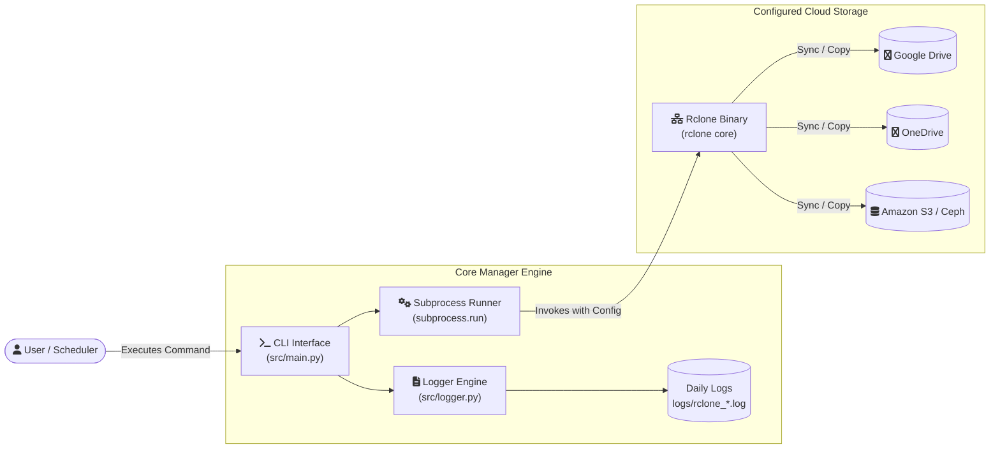

# rclone-cloud-manager

[](https://github.com/rajkotpodman/rclone-cloud-manager/actions/workflows/ci.yml)
[](https://www.python.org/)
[](LICENSE)
[](#installation)

An automated multi-cloud synchronization and backup management suite built on top of Rclone.  
Designed for developers, system administrators, and power users who need reliable, scheduled cross-cloud operations with structured logging.

---

## Features

- **Multi-Cloud Synchronization**: Seamlessly mirror and synchronize datasets across Google Drive, Microsoft OneDrive, Amazon S3, and other providers.
- **Scheduled Automated Backups**: Production-ready automation scripts for Linux/macOS `cron` and Windows Task Scheduler (daily 2:00 AM routines).
- **Interactive CLI & Status Menu**: Intuitive command-line interface featuring colorized console feedback, syntax checking, and fast subcommand dispatching.
- **Daily Rotating Logs & Auditing**: Automatic daily log rotation (`logs/rclone_YYYYMMDD.log`), cron run tracking, and instant last-sync inspection.
- **Credential Protection**: Hardened `.gitignore` design ensuring raw tokens, `.conf` files, and credentials are kept safe from Git repositories.

---

## Architecture Diagram



---

## Installation

### 1. Clone Repository
```bash
git clone https://github.com/your-username/rclone-cloud-manager.git
cd rclone-cloud-manager
```

### 2. Install Rclone
Make sure `rclone` is installed and accessible in your system `PATH`:
- **Windows**:
  ```powershell
  winget install Rclone.Rclone
  ```
- **Linux**:
  ```bash
  sudo -v ; curl https://rclone.org/install.sh | sudo bash
  ```
- **macOS**:
  ```bash
  brew install rclone
  ```

### 3. Create & Activate Virtual Environment
- **Windows (PowerShell)**:
  ```powershell
  python -m venv venv
  .\venv\Scripts\Activate.ps1
  ```
- **Linux / macOS**:
  ```bash
  python3 -m venv venv
  source venv/bin/activate
  ```

### 4. Install Python Dependencies
```bash
pip install -r requirements.txt
```

---

## Usage Examples

Execute commands using the project virtual environment:

### List Configured Remotes
Inspect all remotes configured in your Rclone configuration:
```bash
python src/main.py list-remotes
```

### Synchronize Cloud Remotes
Directly mirror source to destination (deletes files on destination that no longer exist on source):
```bash
python src/main.py sync gdrive: onedrive:
```

### Backup Cloud Remotes
Safely copy new/modified files from source to target with timestamped log entries:
```bash
python src/main.py backup gdrive: s3:
```

### Check Last Sync / Backup Status
Inspect details and output of the most recent operation:
```bash
python src/main.py status
```

---

## Configuration

Rclone credentials and endpoints are managed in the `config/` directory.

1. Copy the example configuration template:
   - **Linux / macOS**:
     ```bash
     cp config/rclone.conf.example config/rclone.conf
     ```
   - **Windows**:
     ```cmd
     copy config\rclone.conf.example config\rclone.conf
     ```

2. Open `config/rclone.conf` in your editor and configure your remotes:
   ```ini
   [gdrive]
   type = drive
   client_id = YOUR_CLIENT_ID_HERE
   client_secret = YOUR_CLIENT_SECRET_HERE
   scope = drive
   token = {"access_token":"YOUR_ACCESS_TOKEN_HERE","token_type":"Bearer","refresh_token":"YOUR_REFRESH_TOKEN_HERE","expiry":"2099-01-01T00:00:00Z"}

   [onedrive]
   type = onedrive
   client_id = YOUR_CLIENT_ID_HERE
   client_secret = YOUR_CLIENT_SECRET_HERE
   token = {"access_token":"YOUR_ACCESS_TOKEN_HERE","token_type":"Bearer","refresh_token":"YOUR_REFRESH_TOKEN_HERE","expiry":"2099-01-01T00:00:00Z"}
   drive_id = YOUR_DRIVE_ID_HERE
   drive_type = personal

   [s3]
   type = s3
   provider = AWS
   access_key_id = YOUR_ACCESS_KEY_ID_HERE
   secret_access_key = YOUR_SECRET_ACCESS_KEY_HERE
   region = us-east-1
   ```

> [!IMPORTANT]
> `config/rclone.conf` is ignored by `.gitignore` to prevent credentials from ever being tracked or leaked to remote repositories.

---

## Screenshots

Visual demonstration of CLI execution, synchronizations, and log outputs:

### 1. CLI Help & Command Discovery


### 2. Multi-Cloud Sync in Action


### 3. Detailed Daily Log Inspection


---

## Roadmap

- [ ] **Bandwidth & Rate Limiting**: Add `--bwlimit` and `--transfers` control options to CLI.
- [ ] **Dry-Run Mode**: Support `--dry-run` flag across `sync` and `backup` commands.
- [ ] **Alerting & Webhooks**: Discord, Slack, and Telegram notifications on failed backup attempts.
- [ ] **Web Dashboard**: Lightweight FastAPI / Vue frontend for monitoring sync jobs and disk quotas.
- [ ] **Docker Containerization**: Pre-packaged Docker image with cron and rclone pre-installed.

---

## License & Author

- **License**: Released under the [MIT License](LICENSE).
- **Author**: Built with ❤️ by the Rclone Cloud Manager Team & Contributors.
