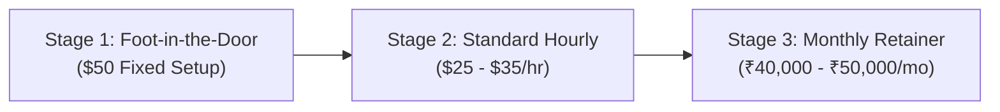

# Freelance Outreach & Application Strategy Guide

A high-conversion tactical framework designed to land recurring cloud automation contracts, scale hourly rates from $10/hr to $25–$50/hr, and maintain a predictable ₹40,000+ to ₹1,00,000/month income stream.

---

## 1. Daily Winning Routine: The 5-Proposals-per-Day System

Consistency compounds. Sending 5 targeted, high-quality proposals daily (100–120 proposals per month) results in a 10–15% response rate and 3–5 signed client contracts per month.

### ⏰ Time Block Structure (Total: ~2 Hours / Day)
| Time Block | Focus | Execution Action |
| :--- | :--- | :--- |
| **Morning (8:30 AM – 9:15 AM)** | **Feed Scan & Quick Pitch (3 Proposals)** | Filter Upwork & LinkedIn for jobs posted within the last 2 hours. Submit 3 quick, tailored proposals before competition saturates. |
| **Midday (1:30 PM – 2:00 PM)** | **Direct Outreach (1 Application)** | Reach out to 1 founder, CTO, or agency owner on LinkedIn/Wellfound with a personalized note referencing their infrastructure. |
| **Evening (6:00 PM – 6:45 PM)** | **Follow-ups & 1 Final Proposal** | Submit 1 proposal on newly posted evening US/EU listings. Follow up with previous leads from the tracker. |

---

## 2. Proposal Customization: How to Stand Out in 3 Seconds

Clients review proposals in a mobile feed; the first **two lines** dictate whether they open your bid.

### 💡 Golden Rules of High-Converting Proposals
1. **Never open with generic greetings**: Eliminate *"Hi, I have 5 years experience in Python and I am interested in your project."*
2. **Open with the client's problem**:  
   > *"Are you looking to automate transfers from Google Drive to S3 without hitting API rate limits or losing file modification dates?"*
3. **Include an immediate proof-of-work link**: Link directly to a relevant repository like [rclone-cloud-manager](https://github.com/rajkotpodman/rclone-cloud-manager). Clients trust code they can verify.
4. **Offer a low-friction next step**: Don't ask for a 1-hour call; ask a single clarifying technical question:
   > *"Are you using a Personal Google Drive or a Google Workspace Shared Drive? (This determines whether domain-wide service accounts are needed)."*

---

## 3. Rate Negotiation Blueprint: Moving from $10/hr to $25/hr & Retainers

Low rates attract micromanaging clients; professional rates attract clients who value peace of mind and business outcomes.

### 🪜 The 3-Stage Price Escalation Ladder

### 💬 Negotiation Scripts

#### A. When Client Proposes $10–$15/hr:
> *"I understand you have a strict budget for initial script setup. I can complete this initial migration as a fixed-price milestone for $60 so you have zero risk on billable hours. Moving forward, my hourly consulting rate is $25/hr, which includes automated daily health monitoring, zero-data-loss verification, and priority error response."*

#### B. Converting a One-Time Job to a ₹40,000/Month Retainer:
> *"Now that the synchronization pipeline between your Drive and S3 is running smoothly, cloud APIs, OAuth tokens, and rate limits naturally evolve.  
> Rather than hiring piecemeal when a sync fails, I offer a **Monthly Infrastructure Maintenance Retainer for ₹40,000 / month ($480 USD)**.  
> This covers:  
> 1. Daily audit log inspection & automated alerts.  
> 2. Monthly token renewal & bandwidth tuning.  
> 3. Guaranteed same-day disaster recovery support if any endpoint disconnects.  
> Would you like me to manage this so your team never has to worry about cloud backups?"*

---

## 4. Red Flags: How to Avoid Scammer & Nightmare Clients

Protect your time, account rating, and mental energy by identifying these warning signs early:

| Red Flag | Danger | Recommended Action |
| :--- | :--- | :--- |
| **"Telegram / WhatsApp me for details"** | 100% scam / off-platform payment evasion. | Report user immediately; keep all communication on the platform until escrow is funded. |
| **Unverified Payment Method on Upwork** | High risk of non-payment or fraudulent chargebacks. | Require client to verify payment method and fund escrow before starting work. |
| **"Simple 10-minute task for a 5-star review"** | Exploitation of new freelancers for free work; prone to leaving punitive 1-star reviews. | Decline politely; prioritize clients with realistic milestone budgets. |
| **Vague Scope ("Need backup script") with refusal to specify endpoints** | Endless revision requests and unpaid scope creep. | Send a structured requirements checklist. Refuse to start without agreed milestone deliverables. |
| **Demanding root/admin credentials prior to contract creation** | Security and identity liability risk. | Request access through temporary read-only test buckets or delegate credentials via screen share. |
