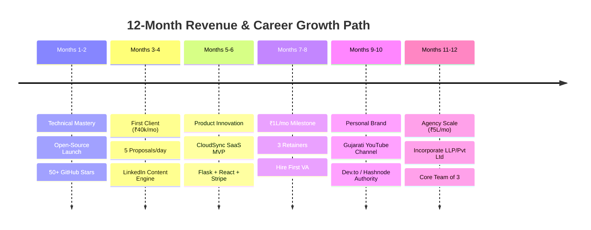

# 12-Month Master Career & Business Roadmap: From Freelancer to Cloud Agency

A strategic, phased 12-month blueprint to scale from open-source project development to a **₹5,00,000/month (~$6,000 USD/month)** Cloud Infrastructure & Automation Agency.

---

## High-Level 12-Month Trajectory Overview



---

## Phase 1: Technical Mastery & Foundation (Months 1–2)
**Theme**: Build undeniable public proof of work.

### Key Objectives
1. **Polish & Perfect `rclone-cloud-manager`**:
   - Maintain 100% test coverage with `pytest`.
   - Implement Docker Compose multi-container support.
   - Harden GitHub Actions CI with automated release tagging.
2. **Open-Source Distribution & Community Growth**:
   - Target: **50+ GitHub Stars**.
   - Post project launch showcases on Reddit (`r/Python`, `r/selfhosted`, `r/DataHoarder`).
   - Submit to Python Weekly and Awesome-Rclone curation lists.
3. **Tooling & Setup**:
   - Set up professional portfolio website using custom domain (`cloud-automation.dev`).
   - Record 5-minute client-facing Loom walkthrough demo.

### Weekly Milestones
- **Weeks 1–2**: Feature freeze on `rclone-cloud-manager`, refine documentation, verify cross-platform Windows/Linux tests.
- **Weeks 3–4**: Create GitHub Release v1.0.0, write announcement blog post, submit to Reddit and developer sub-communities.
- **Weeks 5–6**: Deploy Web Dashboard and automated Telegram/Email monitoring pipeline.
- **Weeks 7–8**: Reach 50 GitHub stars milestone; package case study metrics into proposal portfolio.

---

## Phase 2: First High-Ticket Retainer (Months 3–4)
**Theme**: Client acquisition and revenue validation.  
**Financial Target**: **₹40,000 / month ($500/mo)** baseline retainer.

### Key Objectives
1. **The 5-Proposals-per-Day Upwork Routine**:
   - Submit 5 tailored bids daily searching for: `rclone`, `cloud backup script`, `Google Drive to S3`, `disaster recovery`.
   - Never use generic templates; always include the direct GitHub repo link and video demo.
2. **LinkedIn Authority Content (3x per week)**:
   - **Tuesday**: Technical breakdown (e.g. *“5 Rclone flags that cut cloud bills by 80%”*).
   - **Thursday**: Client case study / problem-solution breakdown.
   - **Saturday**: Architectural diagram or open-source lesson.
3. **First Retainer Close**:
   - Land 1 fixed-price setup ($150–$300) and convert into a monthly ₹40,000 maintenance retainer.

---

## Phase 3: SaaS Productization (Months 5–6)
**Theme**: Transition from pure services to recurring software revenue.  
**Product**: **"CloudSync SaaS"** — A multi-tenant web application for automated cross-cloud replication.

### Technical Architecture
- **Backend**: Python (Flask / FastAPI) + Celery background workers.
- **Frontend**: React.js + TailwindCSS + Lucide Icons.
- **Orchestration**: Docker containers running isolated Rclone daemons per workspace.
- **Billing**: Stripe Billing & Subscription API (Tiers: $19/mo Starter, $49/mo Pro).

### Key Deliverables
- Deploy MVP on a DigitalOcean / Hetzner VPS.
- Implement OAuth login for Google Drive, OneDrive, and S3.
- Onboard first 5 beta users from existing freelance network.

---

## Phase 4: Six-Figure Predictable Revenue (Months 7–8)
**Theme**: Delegation and monthly income stability.  
**Financial Target**: **₹1,00,000 / month ($1,200/mo)**.

### Revenue Breakdown Model
| Source | Units | Rate | Monthly Total |
| :--- | :---: | :--- | :--- |
| **Pro Maintenance Retainers** | 3 Clients | ₹35,000 / mo | **₹1,05,000** |
| **Productized Setup Package** | 1 Client | ₹25,000 fixed | **₹25,000** |
| **Total Projected Gross** | — | — | **₹1,30,000 / mo** |

### Organizational Scale: Hire First Virtual Assistant (VA)
- **Role**: Freelance Operations & Outreach Assistant (Part-time, 15 hrs/week).
- **Responsibilities**:
  - Filter daily Upwork job postings and draft tailored proposals.
  - Review morning Telegram health check notifications.
  - Schedule client check-in calls.

---

## Phase 5: Regional & Global Personal Branding (Months 9–10)
**Theme**: Organic inbound client acquisition through technical content.

### 1. YouTube Channel: "Cloud Automation in Gujarati"
- **Mission**: Become the premier voice for DevOps and Cloud Infrastructure in vernacular Gujarati.
- **Content Topics**:
  - *"ગુજરાતીમાં શીખો: Google Drive થી AWS S3 ઓટોમેશન કઈ રીતે કરવું?"*
  - *"Rclone થી તમારા ડેટા બેકઅપને કઈ રીતે સિક્યોર કરવો?"*
  - *"ફ્રીલાન્સિંગથી મહિને ₹1 લાખ કેમ કમાવા (Real Case Study)?"*
- **Frequency**: 1 long-form high-value video every Sunday; 2 YouTube Shorts per week.

### 2. Technical Blogging (Dev.to & Hashnode)
- Publish in-depth English technical articles targeting global SEO rankings.
- Syndicate content to HackerNoon and Medium.

---

## Phase 6: Cloud Agency Scale (Months 11–12)
**Theme**: Building an equity-backed, scalable cloud engineering agency.  
**Financial Target**: **₹5,00,000 / month ($6,000/mo)**.

### 1. Corporate Formation
- Register as an Indian Private Limited (Pvt Ltd) or LLP.
- Set up GST registration, corporate banking (RazorpayX / Wise Business), and standard NDAs.

### 2. Core Team Structure (3 Members)
```text
┌────────────────────────────────────────────────────────┐
│             Founder / Chief Architect                  │
│       (Enterprise Sales, High-Level Architecture)      │
└────────────────────────────────────────────────────────┘
                            │
         ┌──────────────────┴──────────────────┐
         ▼                                     ▼
┌───────────────────────────────┐     ┌───────────────────────────────┐
│     Cloud DevOps Engineer     │     │   Full-Stack UI / Designer    │
│  (Python, Rclone, Docker, CI) │     │ (React, Tailwind, Client VAs) │
└───────────────────────────────┘     └───────────────────────────────┘
```

### 3. Financial Targets for Month 12
- **Enterprise Retainers**: 4 Enterprise Clients @ ₹80,000/mo = **₹3,20,000**.
- **Standard Retainers**: 3 Clients @ ₹40,000/mo = **₹1,20,000**.
- **CloudSync SaaS MRR**: 30 Users @ $29/mo (~₹70,000) = **₹70,000**.
- **Total Agency Revenue**: **₹5,10,000 / month**.
