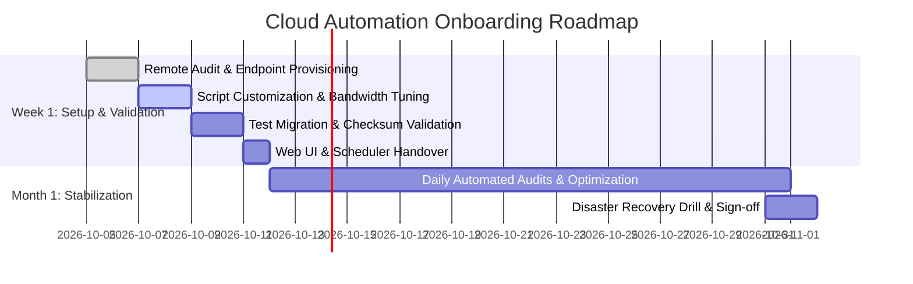

# Enterprise Cloud Automation & Disaster Recovery Proposal
**Prepared For:** Prospective Client  
**Prepared By:** Cloud Automation Engineering Team  
**Date:** October 2026 | **Version:** 2.1  
**Project:** Cross-Cloud Backup Automation & Continuous Integrity Pipeline

---

## 1. Executive Summary

Modern businesses lose an average of **$4,500/month** in billable engineering time and productivity to manual cloud file management, slow upload interfaces, and silent data corruption. Relying on single-cloud storage exposes your critical intellectual property to accidental deletion, account suspension, or regional service outages.

This proposal outlines the implementation of **Rclone Cloud Manager**—a lightweight, military-grade cloud automation suite that mirrors, verifies, and archives company datasets across Google Drive, Microsoft OneDrive, and Amazon S3 with **zero manual effort**, sub-second error logging, and continuous data integrity verification.

---

## 2. Core Technical Architecture & Benefits

```text
[ Primary Cloud (Google Drive / OneDrive) ]
                   │
                   ▼ (Encrypted Stream / Multi-Threaded Chunks)
        [ Rclone Automation Engine ]
                   │
                   ├──► Daily Checksum Integrity Audit (MD5/SHA1)
                   ├──► Rotating Audit Logs (logs/rclone_YYYYMMDD.log)
                   └──► Instant Webhook & Health Alerts
                   │
                   ▼
[ Cold Disaster Vault (AWS S3 / Wasabi / Glacier) ]
```

- **Zero-Data-Loss Guarantee**: Cryptographic hash matching before and after every transfer.
- **Unattended Execution**: Fully scheduled background routines (cron / Windows Task Scheduler).
- **Cost Reduction**: Automated lifecycle policies tiering older files to cold storage (up to 80% cheaper than primary cloud drives).
- **Hardened Security**: Credentials isolated with encrypted tokens; no credentials committed to git.

---

## 3. Scope of Work (Tiered Options)

| Deliverables & Features | Basic (One-Time) | Pro (Monthly Retainer) | Enterprise (Custom SLA) |
| :--- | :---: | :---: | :---: |
| **Connected Cloud Remotes** | 2 Remotes | Up to 4 Remotes | Unlimited Multi-Cloud |
| **Automated Scheduled Backups** | Daily 2:00 AM | Daily + Hourly Incremental | Continuous / Event-Driven |
| **CLI & Automation Scripts** | ✅ Included | ✅ Included | ✅ Included |
| **Web Dashboard (Flask UI)** | Optional Add-on | ✅ Included | ✅ Included |
| **Docker Containerization** | — | ✅ Included | ✅ High-Availability Cluster |
| **Daily Rotating Audit Logs** | ✅ Local Files | ✅ Local + Cloud Archiving | ✅ Centralized Elastic / CloudWatch |
| **Token Refresh & Key Maintenance** | Initial 7 Days | ✅ Continuous Monthly | ✅ Continuous + Dedicated Service Accts |
| **Support SLA** | 7 Days Email | Same-Day Priority (8h) | 24/7 1-Hour SLA + Phone |

---

## 4. Implementation Timeline



- **Total Setup Time**: 5 to 7 Business Days.
- **Operational Impact**: Zero downtime to your existing workflows during installation.

---

## 5. Investment & Pricing Table

| Package Tier | Pricing (INR) | Pricing (USD) | Engagement Model |
| :--- | :--- | :--- | :--- |
| **Basic Setup** | **₹15,000** | **$180** | One-time fixed fee (Includes 7 days stabilization support) |
| **Pro Retainer** | **₹40,000 / mo** | **$480 / mo** | Recommended: Continuous maintenance, daily health audits & updates |
| **Enterprise** | **₹1,00,000 / mo** | **$1,200 / mo** | Multi-account enterprise infrastructure with 24/7 dedicated SLA |

*Terms: 50% upfront deposit on fixed packages; monthly retainers billed at the beginning of each billing cycle.*

---

## 6. Acceptance & Next Steps

To schedule your onboarding sprint:
1. Approve this proposal via written confirmation or email.
2. Complete our 5-minute Cloud Endpoint Questionnaire.
3. Our team provisions your initial migration pipeline within 48 hours.

**Contact & Inquiries:**  
📧 Email: **contact@cloud-automation.dev**  
🐙 Repository: **https://github.com/rajkotpodman/rclone-cloud-manager**

---

### 📄 How to Convert this Proposal to PDF
1. **Using Chrome / Edge / Firefox**: Open this file in your browser or GitHub, press `Ctrl + P`, set Destination to **"Save as PDF"**, select **"Background graphics"**, and save.
2. **Using VS Code / IDE**: Install the extension **"Markdown PDF"** or **"Markdown Preview Enhanced"**, right-click the file and select **Markdown PDF: Export (pdf)**.
3. **Using Pandoc**:
   ```bash
   pandoc client_proposal.md -o client_proposal.pdf --pdf-engine=wkhtmltopdf
   ```
